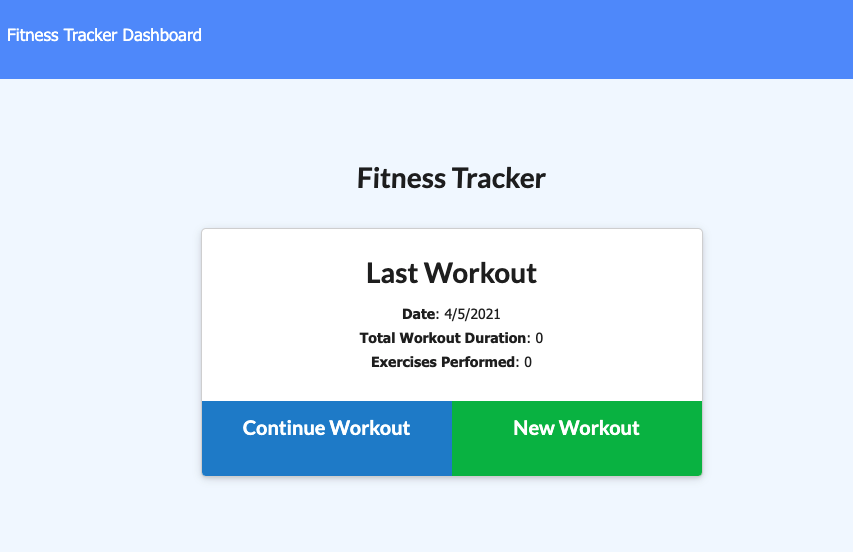
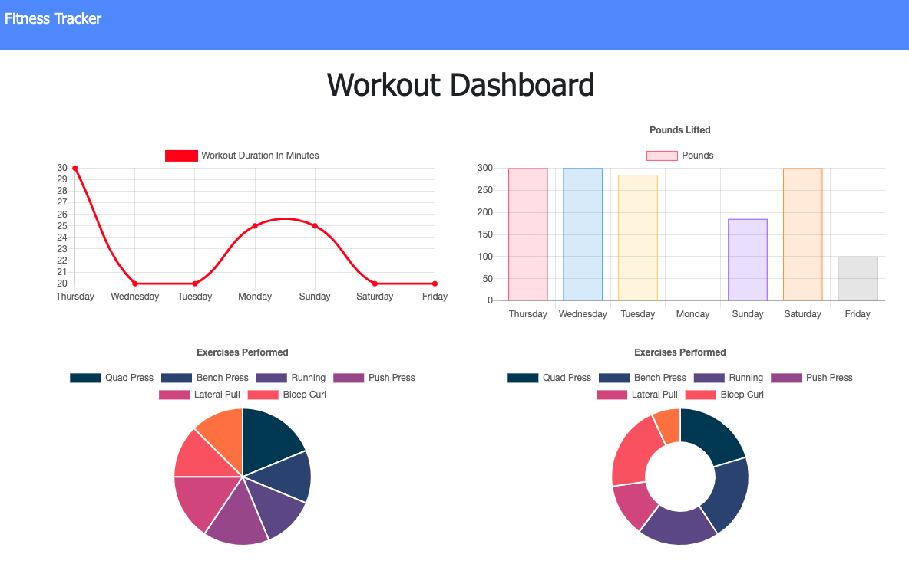

# Workout Tracker  
    
  ## Description  
  This stylish web application provides users with both data collection and tracking in regards to their fitness endeavors.   
  ## Deployed Application  
    
    
  ## [Link to Deployed App](https://guarded-springs-61096.herokuapp.com/?id=606b7d6f66018a00158d38d5)

  ## Table of Contents   
  [Installation](##Installation)  
  [Usage](##Usage)  
  [License](##License)  
  [Contributiing](##Contributing)  
  [Tests](##Tests)  
  [Questions](##Questions)
    
  ## Installation  
  No installation is required for use of this web app.  
  ## Usage  
  Once the user has navigated to the Workout Tracker, they may input pertinent data through the relevant input fields provided. By selecting resistance, the user may input the name of exercise performed as well as list weight amount and number of sets and reps. By selecting cardio, the user may input the type of exercise along with the distance covered. Both exercise types provide a duration field to track the amount of time spent performing the activity. Once the exercise has been added, the dashboard may be used to see the collected data displayed in various graph forms. As it stands currently, the dashboard is tracking the past seven days worth of exercises.  
  ## License   
  This project is not licensed.    
  ## Contributing  
  No guidlines exist at this time.  
  ## Tests   
  No testing instructions exist currently.  
  ## Questions  
  I can be reached at mcbrayer.ian@gmail.com for further information.  
  Please feel free to also check out my work at https://github.com/ihm57511
